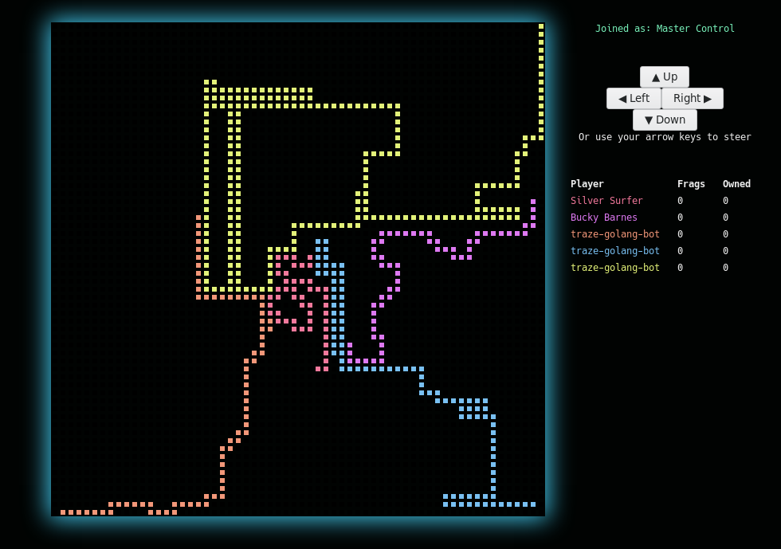

# Traze VanillaJS Client

A complete [traze](https://traze.iteratec.de) UI and client written in plain JavaScript (a.k.a VanillaJS) in about ~200 lines.

## Demo

It's [deployed on github pages](https://iteratec.github.io/traze-javascript-vanilla/)

## Build and Install

Not necessary, simply open index.html in a browser

